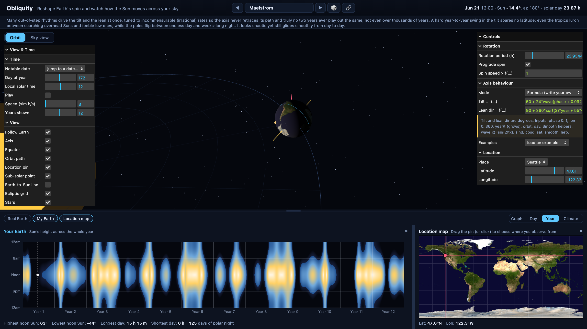
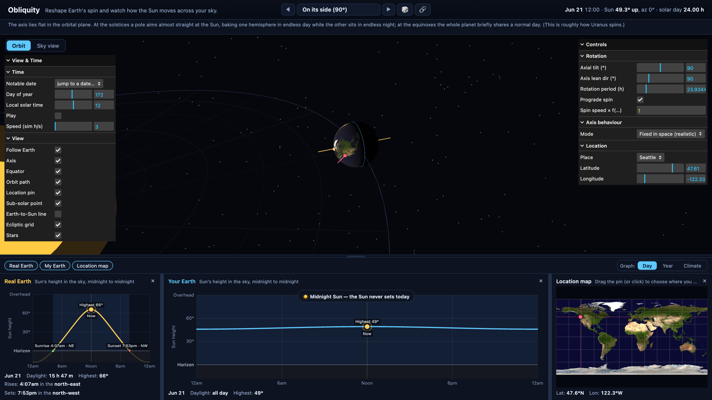
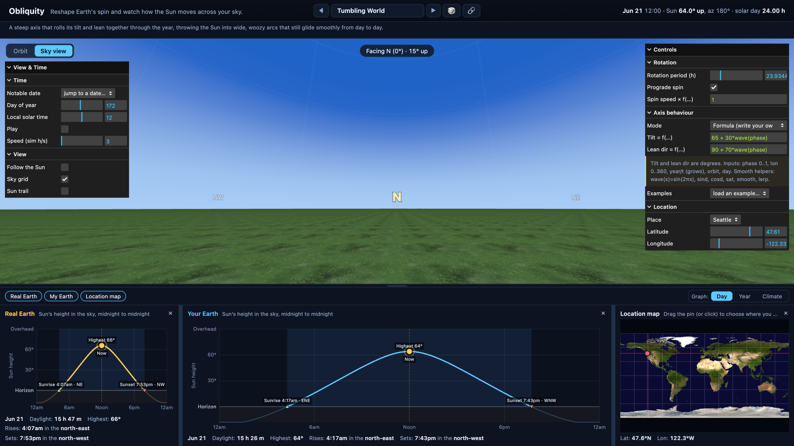

# Obliquity

*Reshape Earth's spin and watch how the Sun moves across your sky.*

Obliquity is an interactive web app for playing with how the Earth spins. The orbit stays exactly as it is, but the rotation is yours to reshape: tilt the axis, point it somewhere new, change the length of the day, reverse the spin, or drive the axis with your own formula. Then, for any place and date, watch how the Sun's path across the sky and the seasons change, with the real Earth always shown next to your version for comparison.

## What you can do

- Reshape the rotation: tilt, axis lean, day length, spin direction.
- Drive the axis with precession, wobble, tumble, or your own tilt, lean, and spin formulas.
- Compare the real Earth beside your version, same place and date.
- See the Sun three ways: a daily arc, a year heatmap, and a felt-warmth climate curve.
- Watch from a 3D orbit or a first-person sky view, anywhere on Earth.
- Jump to solstices, scrub time on the charts, or press play.
- Start from chaos-tuned scenarios, then share your world with one link.

The same place on the June solstice: the real Earth's familiar arc on the left, and a world tipped fully onto its side on the right, where the Sun simply never sets.

The first-person sky view puts you on the ground, watching the Sun arc over a schematic horizon as the day plays out.

## The model

The orbit is fixed. The Sun sits at the origin and the ecliptic plane is the XY plane, with ecliptic north along +Z. The day of the year sets the Sun's ecliptic longitude, which gives the Earth's position and the geocentric Sun direction.

The Earth's orientation is built from three rotations, mapping earth-fixed coordinates into the ecliptic frame: spin about the polar axis, tilt by the obliquity, then lean the axis to its chosen longitude. The north pole direction follows from the obliquity and the lean longitude. The solar declination, which controls how high the Sun can climb at noon, is the angle between the Sun direction and the equatorial plane.

For a given location, the local east, north, and up directions are computed in the earth-fixed frame, and the Sun direction is rotated into that frame to read off altitude and azimuth. The sky diagram sweeps one full rotation with the Sun held at its position for the day, which is the standard assumption for a sun-path diagram. Headline numbers (peak altitude, daylight hours, sunrise and sunset azimuth) are computed in closed form so they are exact.

The clock is anchored to local apparent solar time at your location, so 12:00 always places the Sun on your meridian, its highest point of the day. The length of the solar day emerges from the spin beating against the Sun's mean right ascension rate, found by integrating the Sun's right ascension over one orbit, so changing the rotation period changes how many days fit into the year and how fast everything animates while the orbit stays the same.

A steadily precessing axis is driven by the ecliptic longitude accumulated across every orbit, not just the position within the current year, so its lean direction keeps turning lap after lap instead of resetting. When the precession rate is a whole number of turns per year the result still repeats every year; otherwise each orbit genuinely differs and the climate repeats only over a multi-year cycle. Every other configuration is periodic, so its behaviour is identical from one orbit to the next.

## Formulas

Set the axis behaviour to "Formula (write your own)" and you can drive the axial tilt and the axis lean direction with your own expressions of where the Earth is in its orbit. A separate spin-speed field multiplies the normal rotation rate the same way. Tilt and lean are read in degrees; spin is a multiplier, where 1 is the normal day, 0.5 is half speed, 0 pauses, and a negative value reverses.

The expressions are not JavaScript. They are parsed by a tiny sandboxed evaluator, so nothing you type can reach the page or run as code, and anything that does not parse leaves the last working formula in place with an inline error.

### Variables

| Name | Meaning |
| --- | --- |
| `phase` | Fraction around the orbit, 0 at the March equinox, wrapping at 1. |
| `lon` | The Sun's ecliptic longitude this orbit, 0 to 360 degrees. |
| `day` | Day of the year, 1 to about 365. |
| `year`, `t` | Elapsed time in years, accumulating across orbits so the world keeps evolving. |
| `orbit` | Whole orbits completed so far. |

A formula that uses only `phase`, `lon`, or `day` repeats every year. Bring in `year`, `t`, or `orbit` to make it drift from one orbit to the next; an irrational coefficient such as `0.05*sqrt(2)*year` makes it never exactly repeat.

### Functions and constants

- Trigonometry in radians: `sin cos tan asin acos atan atan2`, and in degrees: `sind cosd tand`.
- Numbers: `abs sign sqrt exp ln log log10 floor ceil round frac pow mod min max`.
- Shaping: `clamp(x,lo,hi)`, `sat(x)` clamps to 0..1, `lerp(a,b,t)` (also `mix`), `step(edge,x)`, `smooth(lo,hi,x)` (also `smoothstep`).
- Waves with period 1: `wave(x)` is a sine, `cwave(x)` is a cosine, `tri(x)` is a triangle.
- Choice: `if(cond,a,b)` picks `a` when `cond` is positive, otherwise `b`.
- Constants `PI`, `TAU` (two PI), `E`, and the operators `+ - * / % ^` with parentheses.

### Tips for a good world

- Build from `wave`, `cwave`, and the trig functions so the axis glides smoothly. `step`, `if`, and `floor` make the Sun jump.
- Use whole-number multiples of `phase`, like `2*phase`, for terms that close cleanly at the year boundary.
- Every result is made finite: anything that would be NaN or infinite becomes 0, `sqrt` of a negative is 0, and the source is length-capped, so a formula can never crash the simulation.
- Keep the spin multiplier above 0. If it crosses zero the day length becomes infinite at the standstill, and the app warns you.

For example, the Tumbling World uses a tilt of `65 + 30*wave(phase)` and a lean of `90 + 70*wave(phase)`.

## Credits

The Earth texture is NASA's public domain Blue Marble imagery. Built with Three.js and lil-gui.
